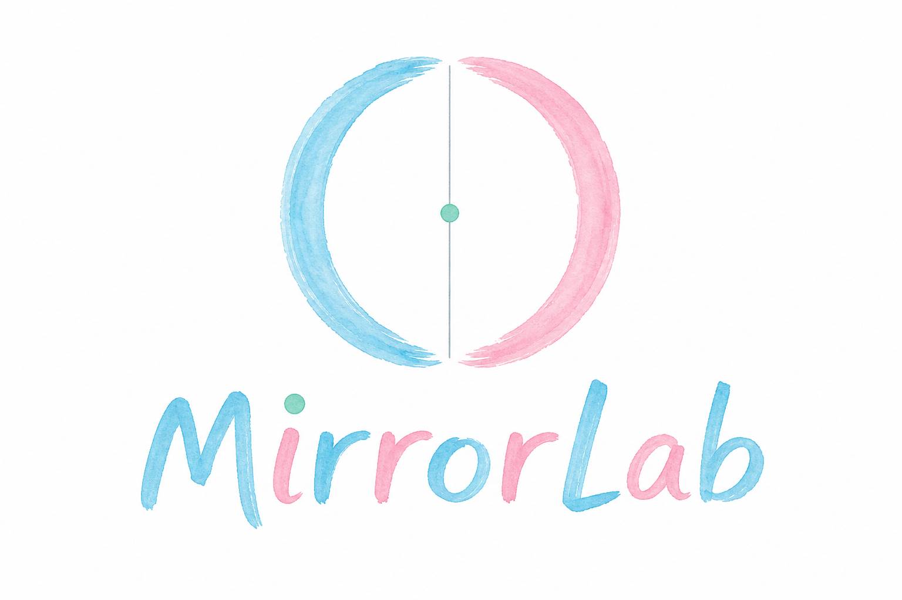
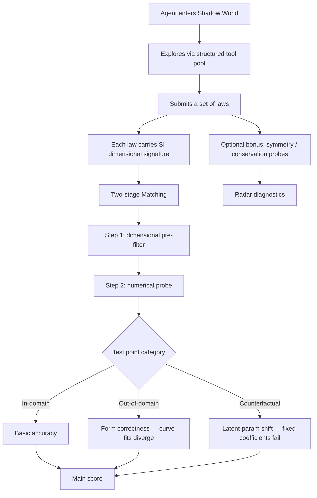
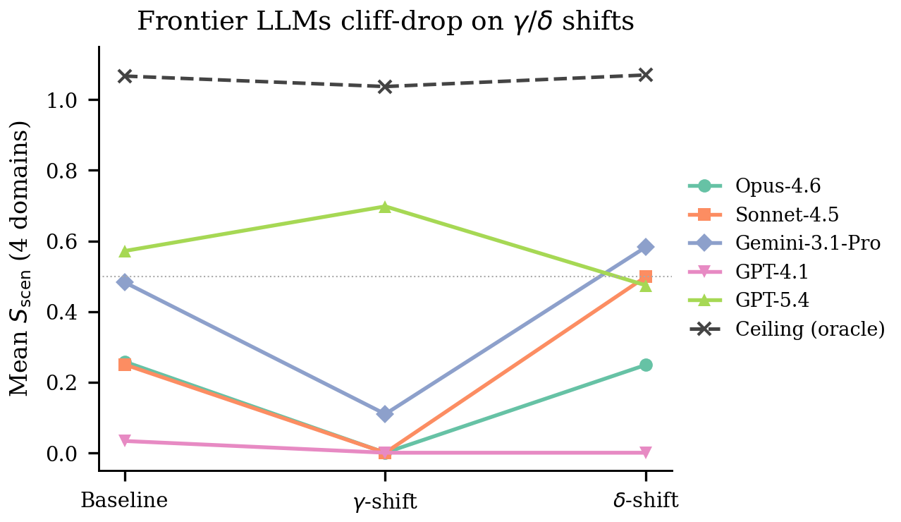
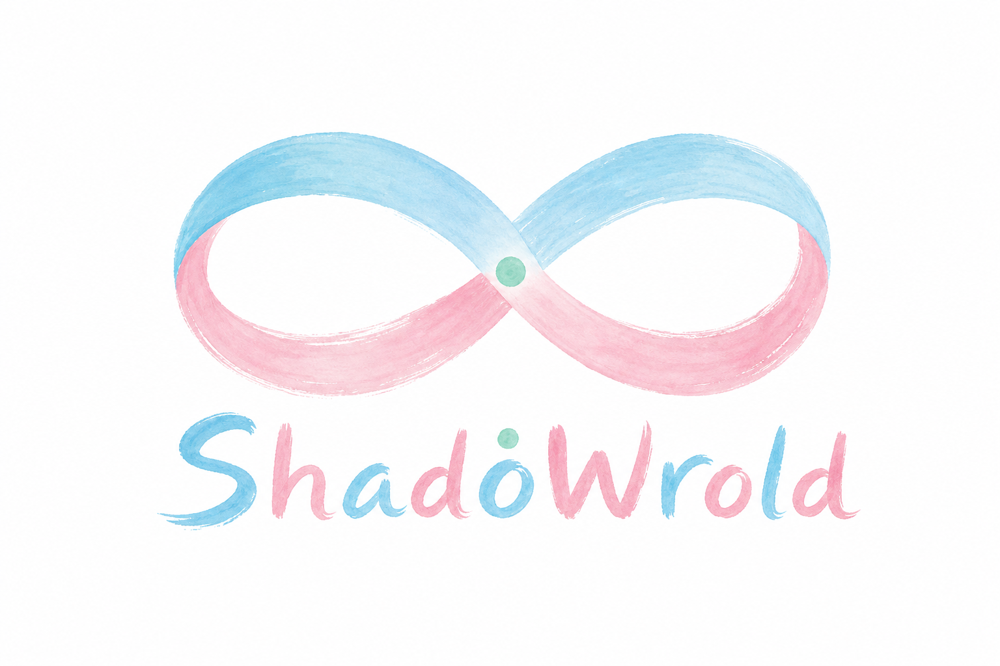

<div align="center">
  

  <h1 style="margin-top: 20px; font-size: 3em; color: #2c3e50;">MirrorLab</h1>
  <p style="font-size: 1.2em; color: #7f8c8d; margin-bottom: 30px;">
    <strong>A Counterfactual Physics Discovery Benchmark, Organized by Symmetry Breaking</strong>
  </p>

  [](docs/program-overview.md)
  [](docs/program-overview.md)
  [](LICENSE)
  [](https://github.com/ShadoWrold)

  <br/>

  [Story](#-story) • [Motivation](#-motivation) • [Design](#-design) • [Evaluation](#-evaluation) • [Roadmap](#-roadmap) • [Docs](#-documentation)

</div>

---

## Introduction

**MirrorLab** is a benchmark for testing whether AI agents — and the world models trained on them — can do physics in worlds where the laws have been *broken in principled ways*. Instead of perturbing constants or exponents (the standard β-type mutations used by NewtonBench and PhysGym), MirrorLab organizes its shifts around **symmetry breaking** (γ-type structural changes) and **conservation-law violation** (δ-type changes). Agents are dropped into a *Shadow World* full of physical scenarios, asked to discover every law that holds, and graded on whether their hypotheses survive out-of-distribution and counterfactual probes.

This repository is the **first of three planned papers** under the broader ShadoWrold research program.

---

## Story

> Imagine a universe where physics is *almost* like ours — but a single symmetry has been quietly broken. Left and right don't behave the same. Heat flows differently in different directions. Gravity carries a hidden direction.
>
> A modern AI walks into this Shadow World armed with a lifetime of textbook physics. Can it *notice* the breakage? Can it design experiments to characterize the new law? Can it tell the unmodified physics from the modified — without crying wolf?
>
> MirrorLab makes this experiment concrete.

Read the full story in plain English: **[docs/story.md](docs/story.md)**

---

## Motivation

| | NewtonBench / PhysGym | **MirrorLab** |
|---|---|---|
| **Shift type** | β (constants, exponents, operators) | **γ (symmetry breaking) + δ (conservation violation)** |
| **Organizing principle** | Per-domain mutations | **Noetherian: each shift breaks exactly one symmetry** |
| **Agent task** | Fit a formula | **Find all laws in the world (modified + unmodified)** |
| **Evaluation** | Symbolic accuracy (LLM-judge) | **Dimensional matching + datapoint probing (in-domain / OOD / counterfactual)** |
| **God-tool defense** | None (PySR/polyfit wins) | **OOD + counterfactual points naturally fail curve-fits** |

> A finding from preliminary literature review: neural network world models can achieve very small MSE on trajectory rollouts while energy-conservation drift is **7,500–36,000× larger** than the MSE itself. Predictions can look right while the physics is silently wrong. (See `docs/r5-elegant-defense.md`.)

---

## Design

<table>
<tr>
<td width="50%">

### Symmetry-Broken Worlds
Shifts are organized by which symmetry or conservation law they break — never two at once. An invariant checker validates each scenario before release.

### Counterfactual Evaluation
After an agent submits a law, the environment perturbs latent parameters (e.g. G → 2G) and asks for a new prediction. Curve-fits fail; physical reasoning survives.

### Big-World Narrative
Agents enter a continuous scenario containing several coexisting laws — some modified, some unchanged. The task is to characterize *all* of them, including the ones that didn't change.

</td>
<td width="50%">

### Open-World Submission
Agents may submit more laws than the scoring rubric covers. Extra (correct or speculative) laws are neither rewarded nor penalized — only the curated checklist is graded.

### Dimensional Signature Matching
Every submission must carry SI dimensional signatures. The grader first filters candidate matches by dimension, then probes with datapoints. No dimensions → automatic zero.

### Dual API (Agent + Auto)
Agent mode runs LLMs with a structured tool pool. Auto mode generates trajectories procedurally for future world-model training (Papers 2 & 3).

</td>
</tr>
</table>

---

## Evaluation



**Why this defends against god-tools.** PySR / polyfit / gplearn produce numerically accurate formulas inside the training range, but their fitted coefficients are frozen — they diverge on OOD points and cannot respond to counterfactual parameter shifts. Truly physical hypotheses re-substitute and survive. The evaluation distinguishes the two without ever forbidding any library.

---

## Project Structure

```
mirrorlab/
├── assets/
│   ├── mirrorlab-logo.png          # bench wordmark
│   └── shadoworld-logo.png         # org wordmark
├── docs/
│   ├── program-overview.md         # full 3-paper program (PI / collaborator view)
│   ├── story.md                    # plain-English 500-word story
│   ├── idea-design-notes.md        # D1–D7 decision log (active design doc)
│   ├── r5-elegant-defense.md       # 27-paper literature review for god-tool defense
│   ├── r1-newtonbench-survey.md
│   ├── r2-physgym-survey.md
│   ├── r3-symmetry-shifts.md
│   ├── r4-cascade-comparison.md
│   └── team-briefing.md            # shared context for the agent team
└── README.md
```

> **Status note.** The repository is currently a **design-stage workspace** (v0.x). No simulator or evaluation code has been committed yet. The `docs/` directory captures the framework-level decisions and literature grounding needed before implementation begins.

---

## Roadmap

| Paper | Title (working) | Status |
|---|---|---|
| **1** | MirrorLab: Counterfactual Physics Discovery Benchmark | 🟢 Sprint 4 TRUE PASS — preprint draft ready ([`paper1/main.pdf`](paper1/main.pdf)) |
| **2** | Counterfactual Diversity Hypothesis for Physical World Models | ⏸ Deferred until Paper 1 ships |
| **3** | Symmetry Recovery via Physics-Inductive World Models | ⏸ Deferred until Paper 2 ships |

Near-term TODO for Paper 1:

- [ ] Fork NewtonBench's 12 simulators as the γ/δ backend
- [ ] Implement invariant checker (symbolic + numerical) for each shift candidate
- [ ] Implement two-stage dimensional matcher
- [ ] Wire structured tool pool (measure / manipulate / analyze / knowledge)
- [ ] Wire dual API (Agent mode + Auto mode)
- [ ] Run adversarial self-test (lookup-attacker AI) to validate benchmark hardness

### Sprint 1 demo

The first end-to-end slice — Hooke domain + γ-1-1 shift wired through
loader → rule-based agent stub → two-stage evaluator → scoring — is live.
A linear stub recovers the baseline law exactly and demonstrably mis-extrapolates
on γ-1-1, which is the entire point of the cross-symmetry evaluator.

```bash
python -m mirrorlab.runners.sprint1_demo --scenario hooke,baseline --seed 0
# Scenario: hooke / baseline (seed 0)
# Stub agent submitted: F = -k*x (linear)
# Ground truth: F = -k x
# Stage-1 (dim): PASS
# Stage-2 (numeric):
#   in-domain RMSLE: 0.000
#   OOD RMSLE: 0.000
#   counterfactual RMSLE: 0.000
#   s_entry: 1.000
# S_scen: 1.000

python -m mirrorlab.runners.sprint1_demo --scenario hooke,g_1_1 --seed 0
# Scenario: hooke / gamma_1_1 (seed 0)
# Stub agent submitted: F = -k*x (linear)
# Ground truth: F = -k x [1 + eta tanh(x / x_scale)]
# Stage-1 (dim): PASS
# Stage-2 (numeric):
#   in-domain RMSLE: 0.069
#   OOD RMSLE: 0.213
#   counterfactual RMSLE: 0.064
#   s_entry: 0.778
# S_scen: 0.778
```

Sprint 1 exit criterion, calibration notes, and Sprint 2/3 hand-off live in
[`docs/sprint1-report.md`](docs/sprint1-report.md).

### Sprint 2 status

Catalog build-out complete. **12 domain baselines + 36 catalog shifts**
(24 γ + 12 δ, three per domain) are registered, build under `registry.make`,
and step cleanly. The **32-tool MVS** (8 measure / 8 manipulate / 8 analyze
/ 8 knowledge) is in place with a green contract suite.

```bash
python -m mirrorlab.runners.sprint2_smoke
# ...
# Registry layer: PASS=48/48 FAIL=0 (baselines=12, shifts=36)
# Exit criterion (§9.2): PASS

python -m pytest -q
# 331 passed in ~134s
```

Two non-gating discrepancies were surfaced and filed back: the Sprint-1
loader's CAL-3 whitelist needs to grow for the new hooke shift dataclasses
(`HookeGamma12Params`, `HookeDelta11Params`), and the loader / agent-stub /
eval pipeline is still hooke-only — generalizing it to the remaining 11
domains is the headline Sprint 3 readiness item. Full numbers, evidence, and
Sprint-3 hand-off live in [`docs/sprint2-report.md`](docs/sprint2-report.md).

### Sprint 3 status

Sprint 3 wires the evaluator + scoring + lookup-attacker chain end-to-end:
real LLM agent through a local OpenAI-compatible proxy ([`mirrorlab/runners/llm_agent.py`](mirrorlab/runners/llm_agent.py)),
universal scoring grids for all 12 domains ([`mirrorlab/scenarios/loader.py`](mirrorlab/scenarios/loader.py)),
the locked-prompt lookup attacker ([`mirrorlab/attacker/`](mirrorlab/attacker/)),
and a 5-knob CAL calibration sweep ([`mirrorlab/calibration/sweep.py`](mirrorlab/calibration/sweep.py)).

The §9.2 exit pilot ran 5 honest scenarios + the 24-cell γ∪δ attacker slice
end-to-end via `mirrorlab.runners.sprint3_pilot` against the local proxy
(`gpt-4.1-20250414`, 188 LLM calls, 0 errors). Pipeline plumbing **PASS**;
attacker `S_bench^lookup = 0.0000 < 0.50` threshold **PASS, but vacuously**
— under the pilot's tightened tool-call budgets neither agent submitted
before exhaustion, so the all-zero scores certify the chain rather than the
attacker's strength. CAL-4 / CAL-9 final lock deferred to Sprint 4 along
with a prompt-vs-budget reconciliation. Full verdict, per-scenario table,
attacker breakdown, and Sprint-4 follow-ups live in
[`docs/sprint3-report.md`](docs/sprint3-report.md) (data:
[`docs/sprint3-pilot-data.json`](docs/sprint3-pilot-data.json)).

### Sprint 3.5 status

Sprint 3.5 re-runs the §9.2 exit pilot after the budget-contract fix:
the agent system prompt now renders against the runtime `max_tool_calls`
(no more advertised-vs-actual mismatch), and the runner default model is
the gpt-5.4 family. The re-pilot via
[`mirrorlab/runners/sprint35_pilot.py`](mirrorlab/runners/sprint35_pilot.py)
runs 5 honest scenarios + 48 attacker runs (24 cells × 2 seeds) in
**361 LLM calls** against `gpt-5.4-20260305` on the local proxy.

**Verdict: TRUE PASS.** 4/5 honest cells now submit under the proper
CAL-7=30 budget (vs 0/5 in Sprint 3); the lookup attacker submits real
textbook claims in 30/48 runs and **`S_bench^lookup = 0.0000` is now
non-vacuous** — γ/δ shifts correctly defeat textbook recall, with no
cell ≥ 0.50 (no catalog Round-3 escalation). CAL-9 is lockable at
`< 0.50`; CAL-4 τ stays direction-locked (0.25-0.35) pending Sprint 4
multi-seed honest data. Full report:
[`docs/sprint35-report.md`](docs/sprint35-report.md) (data:
[`docs/sprint35-pilot-data.json`](docs/sprint35-pilot-data.json)).

### Sprint 4 status

**Verdict: TRUE PASS.** Sprint 4 closes the Paper-1 §9.2 exit criterion:
the cliff plot reproduces across 3/5 frontier LLMs (4/5 if floor effects
count), the oracle ceiling sits comfortably above the rubric at
**median = 1.083**, and the LaTeX draft ([`paper1/main.pdf`](paper1/main.pdf))
builds clean (9 pages, 854/854 tests green).

<div align="center">
  
  <br/>
  <sub><b>Figure 1 (paper hero).</b> Mean S<sub>scen</sub> vs shift tier for five
  frontier LLMs across four representative domains. Four of five models
  collapse to S̄ = 0 at the γ tier; GPT-5.4 is the sole exception
  (S̄ = 0.698 at γ). The oracle ceiling (dashed) stays at ≈ 1.08,
  ruling out the "bench too hard" failure mode.</sub>
</div>

5-model × 12-cell sweep ([`docs/sprint4-sweep-data-final.json`](docs/sprint4-sweep-data-final.json)),
48-pair oracle ceiling ([`docs/ceiling-data.json`](docs/ceiling-data.json)),
6 publication figures ([`figures/`](figures/)), and Paper 1 LaTeX draft
([`paper1/`](paper1/)) land together. Final CAL locks: **CAL-4 τ = 0.35**,
**CAL-7 = 30**, **CAL-8 K = 20 (restored)**, **CAL-9 < 0.50**, **CAL-1
unchanged**, **CAL-3 / CAL-10 carry to camera-ready**. Full report and
reproducibility chain:
[`docs/sprint4-report.md`](docs/sprint4-report.md),
[`docs/sprint4-paper-trail.md`](docs/sprint4-paper-trail.md).

---

## Documentation

| Document | Audience |
|---|---|
| [`docs/story.md`](docs/story.md) | Plain English, non-specialists |
| [`docs/program-overview.md`](docs/program-overview.md) | PI, collaborators, reviewers |
| [`docs/idea-design-notes.md`](docs/idea-design-notes.md) | Active design log (D1–D7) |
| [`docs/r5-elegant-defense.md`](docs/r5-elegant-defense.md) | Literature grounding for god-tool defense |
| [`docs/r1-newtonbench-survey.md`](docs/r1-newtonbench-survey.md) | NewtonBench background |
| [`docs/r4-cascade-comparison.md`](docs/r4-cascade-comparison.md) | CASCADE differentiation |

---

## The ShadoWrold Program

<div align="center">
  
</div>

MirrorLab is the benchmark component of the broader **ShadoWrold** research program (the typo is deliberate — a tiny break in the spelling, echoing the symmetry breaks our shifts induce). Future siblings of this repo will host the world-model trainer, the symmetry-recovery experiments, and the LaTeX sources of the accompanying papers.

---

## License

MIT — see [LICENSE](LICENSE).

---

## Acknowledgments

- **NewtonBench** & **PhysGym** — for the simulator infrastructure and the β-type shift baseline we build on
- **Emmy Noether** — for the theorem that organizes our entire shift taxonomy
- Lee & Yang's *mirror world* hypothesis — distant inspiration for the ShadoWrold name

---

<div align="center">
  <sub>Part of the <a href="https://github.com/ShadoWrold">ShadoWrold</a> research organization.</sub>
</div>
