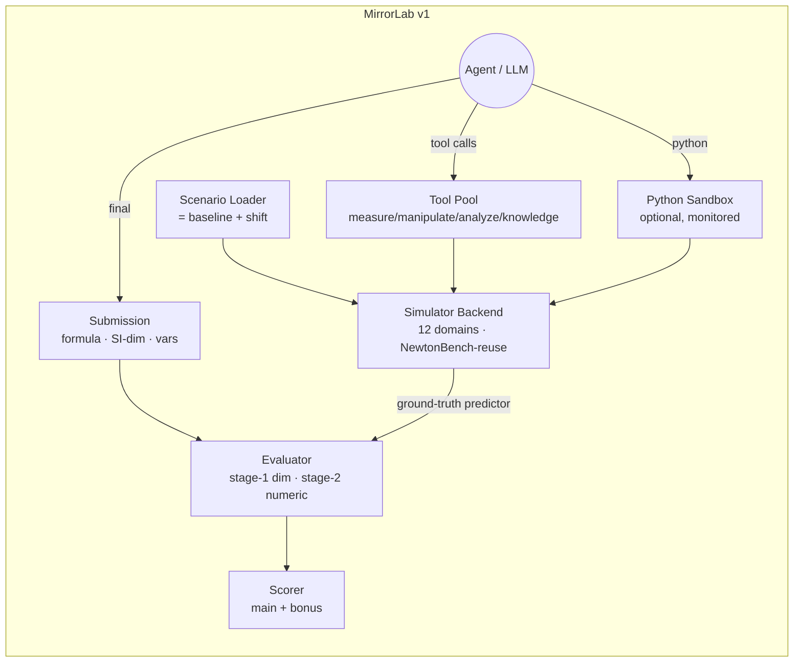

# 论文 1 规范 (Paper 1 Spec) — MirrorLab Benchmark v1

> MirrorLab 项目论文 1 的实现蓝图 (implementation blueprint)。
> v0.1 草稿，2026-05-25。源输入：`d6-shift-catalog.md`（审计后，36/36 已批准）、
> `story.md`、`team-briefing.md`（D1–D7）、`r1-physics-consistency.md`、`r5-elegant-defense.md`。
>
> 风格：技术规范，可执行，不含营销内容。各节 ≤ 1 屏。需要经验校准 (empirical calibration) 的占位符标记为 **[CAL]** 并在 §10 重新汇总。

---

## 1. 范围与非目标 (Scope & Non-goals)

### 范围内 (v1，本论文)

- 一个面向前沿 LLM 智能体 (frontier LLM agents) 的物理发现 (physics-discovery) 评测基准，围绕**一次破坏一个对称性** (one-symmetry-at-a-time) 的反事实位移 (counterfactual shifts) 组织。
- 12 个模拟器域 × {基线 (baseline), γ-层, δ-层} 场景，取自**36-shift 已审计目录** (`d6-shift-catalog.md`)。
- 仅一种运行模式：**Agent 模式 (Agent mode)** —— 提供 LLM 可调用的 `measure` / `manipulate` / `analyze` / `knowledge` 工具，JSON-schema 接口，可选 Python sandbox (D4)。
- 工具池设计 (D3) 带**场景内** (within-scenario) 持久化 (D5 v1 限制)。
- 两阶段评测器 (two-stage evaluator)（量纲预过滤 + 数值预测器测试），含三种测试点类型（域内 (in-domain)、OOD、反事实 (counterfactual)）。
- 对抗自检 (adversarial self-test)：lookup 式攻击者智能体 (lookup-style attacker agent) 必须在发布前得分 < 50 %（D6 R-1 缓解措施）。
- 在 5 个前沿模型上做首轮 SOTA 扫测（校准 `story.md` 中那张 "cliff" 头条图）。

### 范围外（论文 2 / 论文 3 —— 仅留接口）

- **Auto 模式 (Auto mode)** 程序化 rollout API，用于世界模型 (world-model, WM) 训练。模拟器后端将设计一个并行的 `step(state, action) → state'` 接口表面，但 rollout harness、数据集流水线、WM trainer 在论文 2 中交付。
- **跨场景** (cross-scenario) 技能库 / 持久化（完整 D5）。v1 在场景边界冻结技能库；磁盘格式向前兼容，但跨场景复用*禁用* (disabled)。
- **守恒律表征探测** (Conservation-law representation probing)（论文 3）。v1 仅输出一个二元 "智能体是否说出了被破坏的对称性？" 奖励信号 —— 不做内部表征分析。
- 闭式符号等价 oracle (closed-form symbolic equality oracle)。v1 以数值方式给预测器打分；符号等价检查（à la EGG-SR，R5 §1.3）留给后续修订版。

### 非目标（本项目内绝不交付）

- 多模态物理 (Multi-modal physics)（视觉 / 视频）。MirrorLab 仅文本 + JSON。
- 真实实验数据。一切均为模拟；实验消融仅限于对模拟器的数值扰动。

---

## 2. 架构概览 (Architecture Overview)



**数据流** (data flow，一个场景)：

1. `Scenario Loader` 选取一对 `(domain, shift_id ∈ catalog ∪ {baseline})`，在该 shift 文档化的前置条件下采样具体参数，并产出一个全新的沙箱化 `SimInstance`。
2. 智能体获得一段**场景提示词** (scenario prompt)（域叙述、可观测变量、可用工具名称）—— *不*告知 shift 标签也*不*告知公式族。
3. 智能体发起工具调用；`SimInstance` 返回测量结果；智能体可在 token / 墙钟预算下使用 Python sandbox 做离线分析。
4. 在 `submit` 时，智能体产出一个**提交集** (submission set)（§5）。
5. 评测器在留出的测试网格上 (held-out test grid) 跑 stage-1（量纲）然后 stage-2（数值）（§6）。
6. 打分器按场景聚合，然后做基准级 (benchmark-level) 聚合（§7）。

---

## 3. 模拟器后端 (Simulator Backend)

### 3.1 复用 NewtonBench (Reuse of NewtonBench)

我们 **fork** NewtonBench (HKUST-KnowComp/NewtonBench, arxiv 2510.07172) 的 12 个命名域作为基线律 (baseline-law) 层，并在其上加一层薄薄的**shift 注入层** (shift-injection layer)。这 12 个域与目录一一对应：

| # | Domain | Baseline source | Shifts available (catalog) |
|---|---|---|---|
| 1 | Hooke spring | NewtonBench hooke | γ-1-1, γ-1-2, δ-1-1 |
| 2 | Newtonian gravity | NewtonBench gravity | γ-2-1, γ-2-2, δ-2-1 |
| 3 | Damped HO | NewtonBench damped | γ-3-1, γ-3-2, δ-3-1 |
| 4 | Pendulum | NewtonBench pendulum | γ-4-1, γ-4-2, δ-4-1 |
| 5 | Coulomb | NewtonBench coulomb | γ-5-1, γ-5-2, δ-5-1 |
| 6 | RLC | NewtonBench rlc | γ-6-1, γ-6-2, δ-6-1 |
| 7 | Thermal (Fourier) | NewtonBench fourier | γ-7-1, γ-7-2, δ-7-1 |
| 8 | Scalar wave | NewtonBench wave | γ-8-1, γ-8-2, δ-8-1 |
| 9 | Geometric optics (Snell) | NewtonBench snell | γ-9-1, γ-9-2, δ-9-1 |
| 10 | Inviscid fluid (Bernoulli) | NewtonBench bernoulli | γ-10-1, γ-10-2, δ-10-1 |
| 11 | Reaction kinetics | NewtonBench kinetics | γ-11-1, γ-11-2, δ-11-1 |
| 12 | Radioactive decay | NewtonBench decay | γ-12-1, γ-12-2, δ-12-1 |

### 3.2 Shift 注入 (Shift injection)

每个 shift 都实现为一次**函数级替换** (function-level replacement)：取基线的力 / EOM / 速率例程，并用目录指定的表达式替换之，参数在 `Scenario Loader` 阶段按该 shift 文档化的采样与安全前置条件 (safety preconditions) 进行采样。所有 shift 走同一个注册表：

```
mirrorlab/shifts/<domain>/<shift_id>.py  →  ShiftImpl(law, sampler, validator)
```

`validator` 在场景输出时重跑目录中的安全前置条件，并拒绝坏样本（例如 γ-10-2 必须满足 `|λ|·(h_max/h₀)^q < 0.5`）。不变量标签 (invariant labels) 保存在*单独*的文件 (`labels.json`) 中，智能体的提示词永远不会读到它。

### 3.3 双 API 设计 (Dual-API design)（论文 2 接口，v1 不暴露）

`SimInstance` 内部暴露两个接口表面：

- `agent_api`：LLM 智能体唯一可达的接口表面。工具中介、被监控、限速。
- `auto_api`：裸接口 `reset()`、`step(action) → obs`、`close()`。v1 中**禁用**，由一个出厂为关 (ships off) 的特性开关守护。在代码库中文档化为论文 2 的 WM 训练 rollout 入口。

这样可以现在就冻结 API 契约，让论文 2 不必之后重写后端。

---

## 4. 工具池设计 (Tool Pool Design)

四类 (D3)。每个工具有声明的**token 成本** (token cost)（计入每场景预算），且在 v1 中**跨场景无状态** (stateless across scenarios)。

### 4.1 最小可行集 (≥ 每类 8 个 —— 在 Sprint 2 校准时调整)

**Measure**（只读，观测模拟器状态）

1. `measure.position(body_id, t)` — 返回位置观测 + 噪声。
2. `measure.velocity(body_id, t)` — 一阶差分 / 直接读取，视域而定。
3. `measure.field(probe_point, field_type)` — 用于 EM / 热 / 流体域。
4. `measure.energy(system)` — 总机械 / 电能估计器。
5. `measure.spectrum(signal, window)` — 对工具采集到的信号做 FFT。
6. `measure.trajectory(body_id, t_window, sample_rate)` — 批量轨迹拉取。
7. `measure.scattering(beam, target)` — 域特定（光学、引力探针）。
8. `measure.observable(name)` — 域列出的额外可观测量（如电荷密度）。

**Manipulate**（发起受控干预 (controlled interventions)）

1. `manipulate.set_initial(body_id, state)`
2. `manipulate.apply_impulse(body_id, Δp, t)`
3. `manipulate.set_external_field(field_spec)` — 在域允许的范围内
4. `manipulate.set_boundary(boundary_spec)` — 用于 PDE 域
5. `manipulate.set_parameter(param_name, value)` — 仅限域白名单子集
6. `manipulate.reset()` — 重置为场景默认值
7. `manipulate.swap_bodies(i, j)` — 互换测试（对 γ-9-2 互易性 (reciprocity) 有用）
8. `manipulate.time_reverse_probe(t_window)` — 对称性探针 (T-rev 测试)

**Analyze**（仅计算，不接触模拟器）

1. `analyze.fit(model, data, init)` — 最小二乘 / 非线性拟合
2. `analyze.dim_check(expr, units)` — SI 量纲一致性
3. `analyze.symmetry_probe(data, kind)` — 在容差内检查 PAR/ROT/T-rev/SCALE 不变性 (invariance)
4. `analyze.conserved_search(trajectory, ansatz_list)` — 拟合运动常数 (constants of motion)
5. `analyze.spectral(signal)` — 峰值检测，谐波内容
6. `analyze.residual(model, data)` — RMS 残差 + 结构化残差可视化 stub
7. `analyze.regress(features, target)` — 通用 OLS / LASSO 前端
8. `analyze.compare(model_a, model_b, data)` — 似然比 (likelihood-ratio) 代理

**Knowledge**（带成本地从冻结的知识缓存读取）

1. `knowledge.lookup(law_name)` — 返回某命名律 (Hooke、Coulomb...) 的规范表述。高成本。
2. `knowledge.search_symmetries(domain)` — 返回基线域中可用对称性的*通用*列表。中成本。
3. `knowledge.list_units(quantity)` — SI 单位参考。低成本。
4. `knowledge.solve_ode(spec)` — 符号 ODE 求解器外观 (façade)。高成本。
5. `knowledge.simplify(expr)` — CAS 化简。低成本。
6. `knowledge.taxonomy(domain)` — 命名效应列表（如 "Yukawa"、"Duffing"），用于刻意引诱 lookup 式尝试（审计是否与目录重叠，见 §8）。中成本。
7. `knowledge.constants(name)` — 基本常数（G, k_e 等）。低成本。
8. `knowledge.cite(query)` — 不透明的 "文献片段" 钩子（返回通用教材摘录，绝不返回目录 shift）。中成本。

### 4.2 持久化 (Persistence)（D5，v1 形式）

- **场景内**：智能体编写的 Python 片段 / 拟合好的模型在一个场景内通过 scratchpad 持续存在。
- **跨场景**：scratchpad **清空**。磁盘 schema 向前兼容（`scratchpad/{scenario_id}.json`，带版本化信封 (versioned envelope)），但跨场景 loader 由一个标志硬禁用。

### 4.3 库调用监控 (Library-call monitoring)

我们**不**禁用 `numpy`、`scipy`、`sympy`、`sklearn`，甚至不禁用 `pysr` / `gplearn`。Sandbox 监控记录（按场景）：

- 工具调用（名称、参数 hash、延迟、成本）。
- Python 导入列表 + 每个导入的累计墙钟与 token 等价算力。
- 提交的公式是否由 `pysr` / `gplearn` / `polyfit` 调用产生（尽力做静态 + 动态检测 —— 标记进可报告的轴 (reportable axis)，不予惩罚）。

评测基准依赖于 R5 §1 的**优雅防御** (elegant defense)（外推 (extrapolation) + 跨场景一致性 + 反事实探针），而非禁用工具 —— 被测量到的"上帝工具" (god-tool) 使用率是一个*可报告轴*，不是强制规则。

---

## 5. 提交格式 (Submission Format)

每个场景以智能体输出一个**提交集** (submission set) 结束 = 一个或多个候选律 (candidate laws) 的列表。每条目：

```json
{
  "law_id": "L1",
  "formula": "F = -k*x - alpha*x**3",
  "predictor": { "lang": "python", "code": "def f(x, k, alpha): return -k*x - alpha*x**3" },
  "inputs":  [ {"name": "x",     "units": "m"} ],
  "outputs": [ {"name": "F",     "units": "kg*m/s**2"} ],
  "params":  [ {"name": "k",     "units": "kg/s**2", "value": 4.21},
               {"name": "alpha", "units": "kg/(m**2 s**2)", "value": 0.13} ],
  "claim_broken_symmetry": "LIN"     // optional, scored as bonus (§7)
}
```

### 5.1 规则

- **Formula**（字符串，人类可读）与**predictor**（可调用）必须一致（评分前以随机输入做对等性测试 (parity test)）。
- **SI 量纲签名** (SI dimensional signature) 是强制的。缺失或畸形单位 ⇒ 该条目**自动 0 分** (auto-0)（stage-1 量纲过滤器失败即关闭）。
- **变量名**必须引用场景声明的可观测量。未知变量 ⇒ auto-0。
- **集合内部一致性不要求** (Internal consistency across the set is NOT required)（目录 "Option A"，参见 D6 R-1 讨论）。每个条目独立评分；*得分最高的*条目贡献主分，需附加一个针对集合大小的小惩罚 (small penalty for set size)（§7），以阻止散弹枪式提交 (shotgun submissions)。

### 5.2 集合大小上限

`|submission_set| ≤ 5`（每场景）。更大的集合按声明顺序截断到智能体的前 5 个。

---

## 6. 评测协议 (Evaluation Protocol)

### 6.1 Stage 1 —— 量纲预过滤 (dimensional pre-filter)

对每个提交条目：基于声明的输入 / 输出 / 参数单位计算 `formula` 的 SI 量纲签名；验证输出与场景声明的输出量纲匹配。失败 ⇒ 条目得分 = 0，不进入 stage 2。

### 6.2 Stage 2 —— 数值匹配 (numerical matching)

对每个存活的条目，在一个**留出测试网格** (held-out test grid) 上评估 predictor，该网格的 $N_{test}$ 个点采样自三个子网格：

| Sub-grid | Symbol | Purpose | Default share (v1, **[CAL]**) |
|---|---|---|---|
| (a) 域内 (in-domain) | $\mathcal{T}_a$ | 采样范围与智能体的测量窗口重叠 | 0.40 |
| (b) OOD | $\mathcal{T}_b$ | 采样范围在测量窗口之外；R5 §1 主旨 | 0.40 |
| (c) 反事实 (counterfactual) | $\mathcal{T}_c$ | 评估时刻对潜在场景参数进行扰动 (R5 §3) | 0.20 |

逐点误差度量：predictor 与 ground truth 在每个输出通道上的 **RMSLE**（选 RMSLE 因其跨尺度鲁棒性，与 NewtonBench 一致）。

每条目得分：$s_{entry} = \exp(-\bar{R} / \tau)$，其中 $\bar{R}$ 是用上方份额权重对三个子网格的加权平均 RMSLE，$\tau$ 是一个 **[CAL]** 尺度（Sprint-3 校准；目标占位值 $\tau = 0.5$）。

### 6.3 奖励探针（对称性 / 守恒识别） (Bonus probe — symmetry / conservation recognition)

若 `claim_broken_symmetry` 存在且匹配 ground-truth shift 标签（例如对 γ-2-1 给出 `"ROT"`），授予 `b = 0.10` 奖励 (**[CAL]**)。错误声明 ⇒ 无惩罚。基线场景接受 `"none"` 作为正确声明。

这是智能体得到的关于*不变量标签*层 (invariant-label layer) 的唯一信号；它*不*泄露公式。

---

## 7. 评分公式 (Scoring Formula)

每场景：

$$
S_{scen} = \max_{e \in \text{submission}} s_{entry}(e) \cdot \big(1 - \rho \cdot (|\text{submission}|-1)\big) + b \cdot \mathbb{1}[\text{symmetry claim correct}]
$$

其中 `ρ = 0.05` (**[CAL]**) 是超出第一项之外每多一条目的散弹枪惩罚。$S_{scen} \in [0, 1+b]$。

基准级聚合：先对每个 (domain, tier) 单元 (cell) 做宏平均 (macro-mean)，再对所有单元做等权平均：

$$
S_{bench} = \frac{1}{|\text{cells}|} \sum_{(d, t) \in \text{cells}} \frac{1}{|\text{scen}(d,t)|} \sum_{s} S_{scen}(s)
$$

其中 `tier ∈ {baseline, γ, δ}`、`domain ∈ {1..12}` ⇒ 36 个单元。

### 7.1 报告轴 (Reporting axes)（论文 1 头条图）

1. **Cliff plot**：每层 (baseline / γ / δ)、每模型的 $S_{bench}$。预期模式（按 `story.md` 假设）：baseline 上高，γ 上中，δ 上接近随机。
2. **逐域热图** (Per-domain heatmap)：12 × 3 单元，一模型一面板。
3. **OOD vs 域内 gap** (OOD vs in-domain gap)：每层 $\langle s_a \rangle - \langle s_b \rangle$ —— R5 §1 中 "外推杀死上帝工具" (extrapolation kills god-tool) 这条轴。
4. **反事实鲁棒性** (Counterfactual-robustness)：仅 $\langle s_c \rangle$，每层 —— R5 §3 轴。
5. **对称性命名准确率** (Symmetry-naming accuracy)：每层、每模型 $\mathbb{1}[\text{claim correct}]$ 的比率 —— 独立于公式准确率。
6. **工具池使用画像** (Tool-pool usage profile)：每模型工具类别调用次数的堆积条形 —— 仅描述性，不计分。

---

## 8. 对抗自检（Lookup 攻击者）(Adversarial Self-Test — Lookup Attacker)

### 8.1 目标

在发布前，证明一个 **lookup 式攻击者** —— 其策略是 "把观察到的律匹配到教材分类法 (textbook taxonomy) 并重新发出" 的智能体 —— 在 γ ∪ δ 切片上得分**低于 50 %** 的 $S_{bench}$。阈值：$S_{bench}^{lookup}(\gamma \cup \delta) < 0.50$ (**[CAL]**)。

### 8.2 实现

- **攻击者提示词** (locked-in template)：*"You are an expert physicist. You will observe a physical system through tool calls. After at most $K$ tool calls, submit the closest matching known law from your training data. Prefer canonical textbook forms. Do not propose novel modifications."* 加上标准的场景可观测量。
- **攻击者模型**：与最强评测目标同族的前沿 LLM（最坏攻击者假设）。每场景一次攻击者运行，$K = 20$ (**[CAL]**)。
- **通过判据**：完整基准运行；在 24 个 γ + 12 个 δ 场景上的聚合 $S_{bench}^{lookup}$。
- **门控**：若任一单元上 $S_{bench}^{lookup} ≥ 0.50$，违例 shift 退回目录第 3 轮（重随机化参数范围、换备用主旨 (alternate motif)、或升级给物理学家 A/B）。

### 8.3 与目录的交互

按第 2 轮审计 (`d6-shift-catalog.md` line 800)，所有 36 个 shift 已通过抗攻击启发式检查。§8.2 是公开发布前的**闭环验证** (closed-loop verification)。

---

## 9. 工程计划 (Engineering Plan)

### 9.1 目录布局 (target)

```
mirrorlab/
├── mirrorlab/
│   ├── domains/         # 12 baseline domain implementations (forked from NewtonBench)
│   ├── shifts/          # 36 catalog shifts, registry + impls
│   ├── scenarios/       # Scenario Loader, prompt templates, labels.json
│   ├── tools/           # measure / manipulate / analyze / knowledge
│   ├── sandbox/         # Python sandbox + monitor
│   ├── eval/            # stage-1 dim + stage-2 numeric + scoring
│   ├── attacker/        # lookup-attacker harness (§8)
│   ├── runners/         # per-model run drivers (Claude / GPT / Gemini / DeepSeek / o-series)
│   └── reports/         # plot + table generators for Paper 1 figures
├── tests/
│   ├── catalog/         # one test per shift: dim, single-break, safety preconditions
│   ├── tools/           # contract tests per tool
│   └── eval/            # golden-submission round-trips
├── docs/                # this spec + design notes
└── pyproject.toml
```

### 9.2 Sprint（4 × 2 周，假设小团队、无 GPU）

| Sprint | Deliverable | Exit criterion | ETA (assuming start 2026-06-01) |
|---|---|---|---|
| 1 | Sim backend skeleton + 1 demo shift end-to-end | A single γ-1-1 scenario runs from loader → agent stub → eval → score | 2026-06-14 |
| 2 | Full 36-shift catalog wired + tool pool MVS (§4) | All 36 catalog shifts emit valid scenarios; tool contract tests green | 2026-06-28 |
| 3 | Evaluator (§6) + scoring (§7) + lookup-attacker (§8) | Pilot run on 5 scenarios × 1 model passes; attacker scores < 50 % on a sampled γ+δ slice | 2026-07-12 |
| 4 | 5 frontier-model sweep + Paper 1 figures + writing | Cliff plot reproduces, all six reporting axes produced; draft submitted | 2026-07-26 |

假设：2 名工程师全职、API 预算到位、无模型侧脚手架 bug。滑期风险集中在 Sprint 2（工具设计迭代）和 Sprint 4（模型侧可复现性）。

---

## 10. 开放校准项 (Open Calibration Items)

所有 **[CAL]** 占位符的单一登记处。每一条都是 v1 框架无法从第一性原理固定的值；Sprint-3 消融实验 (ablations) 会钉住它们。

| ID | Item | Default placeholder | Decision rule |
|---|---|---|---|
| CAL-1 | Test-point shares $(\pi_a, \pi_b, \pi_c)$ | (0.40, 0.40, 0.20) | tune until the OOD-vs-in-domain gap is statistically detectable on baseline tier without saturating |
| CAL-2 | OOD ratio (extrapolation distance) | 5× sampling range | NewtonBench-comparable; revisit if SR baselines collapse instantly |
| CAL-3 | Counterfactual perturbation magnitude | ±30 % on shift's free parameters | small enough that the *correct* law transports, large enough that fitted constants don't |
| CAL-4 | Score temperature $\tau$ | 0.5 | calibrate so a trivial-constant predictor scores ~0 and the GT law scores > 0.9 |
| CAL-5 | Symmetry-bonus weight $b$ | 0.10 | small enough that it can't substitute for a wrong formula |
| CAL-6 | Shotgun penalty $\rho$ | 0.05 / extra entry | tune against attacker submitting 5× textbook laws |
| CAL-7 | Per-scenario tool budget | 30 tool calls + 60 s sandbox wall-clock | revisit if frontier models hit ceiling on baseline tier |
| CAL-8 | Attacker tool-call budget $K$ | 20 | set so the attacker can identify a *named* law but can't fit a non-textbook one |
| CAL-9 | Lookup-attacker pass threshold | < 0.50 $S_{bench}$ on γ ∪ δ | gate value — if loose, harder; if tight, may force catalog round-3 |
| CAL-10 | Per-cell scenarios | 3 random seeds per cell ⇒ 108 scenarios total | enough for cell-level mean ± std; expand if variance dominates |
| CAL-11 | Frontier-model panel | Claude Opus, GPT-5, Gemini 2.5 Pro, DeepSeek-R2, o-series | confirm versions at Sprint 4 launch (API drift risk) |
| CAL-12 | Knowledge-tool cost ratio | 5× a measure call | discourage but don't ban; tune against the attacker baseline |
| CAL-13 | RMSLE clamp on degenerate predictors | clamp at $10^6$ before RMSLE | avoid `inf` from divergent fits |

—— 论文 1 规范结束 ——
